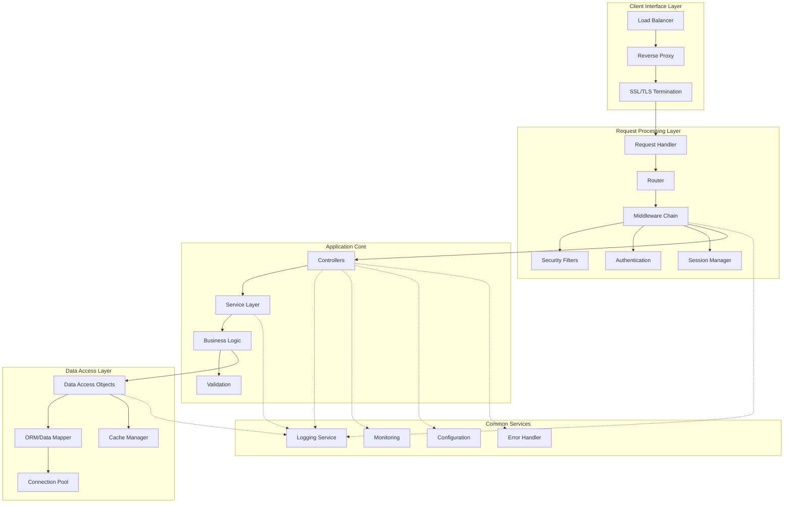
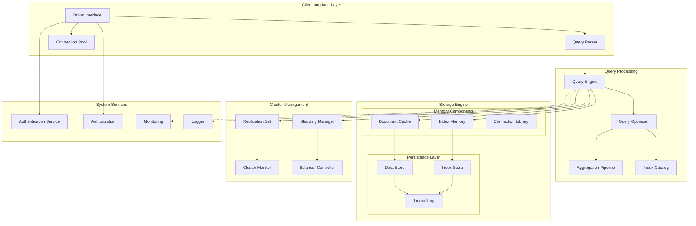

# Web Application Architecture Components
Let me explain each major component layer:

### Client Interface Layer

* Load Balancer: Distributes incoming traffic
* Reverse Proxy: Handles request forwarding and caching
* SSL/TLS Termination: Manages secure connections

### Request Processing Layer

* Request Handler: Initial request processing
* Router: URL/endpoint mapping
* Middleware Chain: Request/response pipeline
* Security Filters: Input validation, XSS prevention
* Authentication: User verification
* Session Manager: User session handling

### Application Core

* Controllers: Request/response coordination
* Service Layer: Business operations orchestration
* Business Logic: Core application rules
* Validation: Input/data validation

### Data Access Layer

* Data Access Objects: Database interaction
* ORM/Data Mapper: Object-relational mapping
* Connection Pool: Database connection management
* Cache Manager: Data caching

### Common Services (Cross-cutting Concerns)

* Logging Service: Application logging
* Monitoring: Performance/health tracking
* Configuration: App settings management
* Error Handler: Exception management

#### Key Component Interactions:

* All requests flow through the Client Interface Layer for initial processing
* Request Processing Layer handles common concerns before reaching business logic
* Application Core contains the main business logic and workflows
* Data Access Layer provides consistent data storage interface
* Common Services are accessed by all layers for cross-cutting concerns

# Document Store Database Architecture
Let me explain the key components and their roles:

### Client Interface Layer

Driver Interface: Handles client connections and requests
Query Parser: Converts queries into internal format
Connection Pool: Manages database connections

#### Query Processing

Query Engine: Core query execution
Query Optimizer: Query plan optimization
Aggregation Pipeline: Handles data aggregation operations
Index Catalog: Manages available indexes

### Persistence Layer

#### Memory Components:

Document Cache: In-memory document storage
Index Memory: In-memory index storage
Connection Library: Connection management

### Storage Engine:

Journal Log: Write-ahead logging
Data Store: Document storage on disk
Index Store: Index storage on disk

### Cluster Management

Replication Set: Manages data replication
Sharding Manager: Handles data distribution
Cluster Monitor: Health monitoring
Balancer Controller: Data balance across shards

### System Services

* Authentication Service: User authentication
* Authorization: Access control
* Monitoring: System metrics
* Logger: System logging

## Key Interactions:

Client requests flow through the Driver Interface to Query Processing
Query Engine coordinates with Storage Engine for data access
Cluster Management ensures data distribution and availability
System Services provide cross-cutting functionality

### Common Design Patterns:

Write operations go through Journal Log before persistence
Read operations check Document Cache before disk access
Queries are optimized using Index Catalog
All operations are authenticated and authorized
Monitoring and logging track system health and performance

# Infrastructure Tools Entity Relationship Diagram
Let me break down the main tool categories and their relationships:

### Container Orchestration & Management

* Kubernetes: Container orchestration platform
* Helm: Package manager for Kubernetes
* etcd: Distributed key-value store for Kubernetes

### Infrastructure as Code & Provisioning

* Terraform: Infrastructure provisioning
* Cloud Providers (AWS/GCP/Azure): Resource targets
* Ansible: Configuration management
* Inventory: Target hosts/environments

### Monitoring & Observability
* Prometheus: Metrics collection
* Grafana: Visualization platform
* AlertManager: Alert handling
* ELK Stack:
    * Elasticsearch: Log storage
    * Logstash: Log processing
    * Kibana: Log visualization

### CI/CD & Artifact Management

* Jenkins: Automation server
* GitHub: Source code management
* SonarQube: Code quality
* Artifactory: Artifact repository

### Security & Secret Management

* Vault: Secret management
* Certificates: SSL/TLS management
* Secrets: Credentials, keys, tokens

## Key Relationships:
* Kubernetes is monitored by Prometheus
* Terraform provisions cloud resources
* Jenkins pulls from GitHub and stores in Artifactory
* ELK stack components work together for log management
* Vault provides secrets to multiple tools

```mermaid
erDiagram
    KUBERNETES ||--o{ PROMETHEUS : "monitored_by"
    KUBERNETES ||--|{ HELM : "managed_by"
    KUBERNETES }|--|| ETCD : "stores_state_in"
    
    TERRAFORM ||--o{ AWS : "provisions"
    TERRAFORM ||--o{ GCP : "provisions"
    TERRAFORM ||--o{ AZURE : "provisions"
    TERRAFORM ||--|| VAULT : "fetches_secrets_from"
    
    PROMETHEUS ||--|{ GRAFANA : "visualized_by"
    PROMETHEUS ||--|| ALERTMANAGER : "alerts_through"
    
    JENKINS ||--|{ GITHUB : "pulls_from"
    JENKINS ||--|| SONARQUBE : "scans_with"
    JENKINS }|--|| ARTIFACTORY : "stores_artifacts_in"
    
    ANSIBLE ||--|{ INVENTORY : "manages"
    ANSIBLE ||--|| VAULT : "fetches_secrets_from"
    
    ELK ||--|{ LOGSTASH : "ingests_through"
    ELK ||--|{ ELASTICSEARCH : "stores_in"
    ELK ||--|{ KIBANA : "visualized_by"
    
    VAULT ||--|{ SECRETS : "stores"
    VAULT ||--|{ CERTIFICATES : "manages"
    
    MONITORING {
        string metrics
        string alerts
        string dashboards
        string logs
    }
    
    DEPLOYMENT {
        string containers
        string configurations
        string versions
        string environments
    }
    
    SECURITY {
        string secrets
        string certificates
        string policies
        string access_controls
    }
    
    AUTOMATION {
        string pipelines
        string playbooks
        string templates
        string scripts
    }

```
